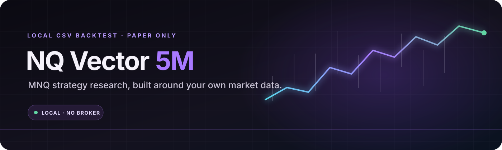
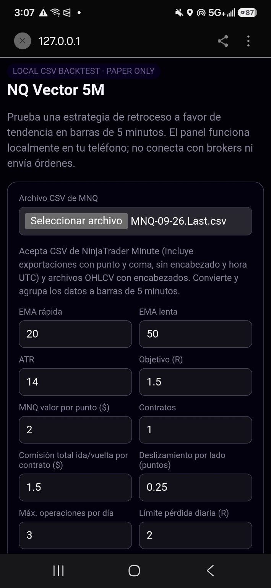
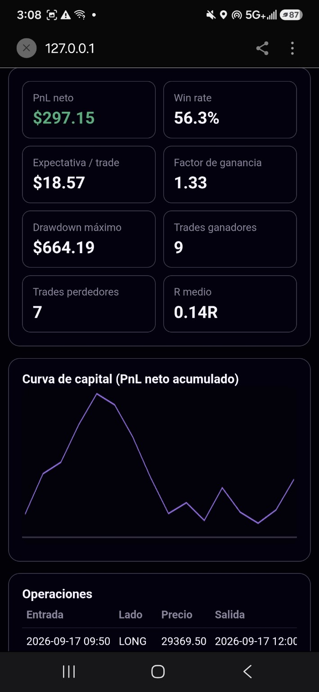
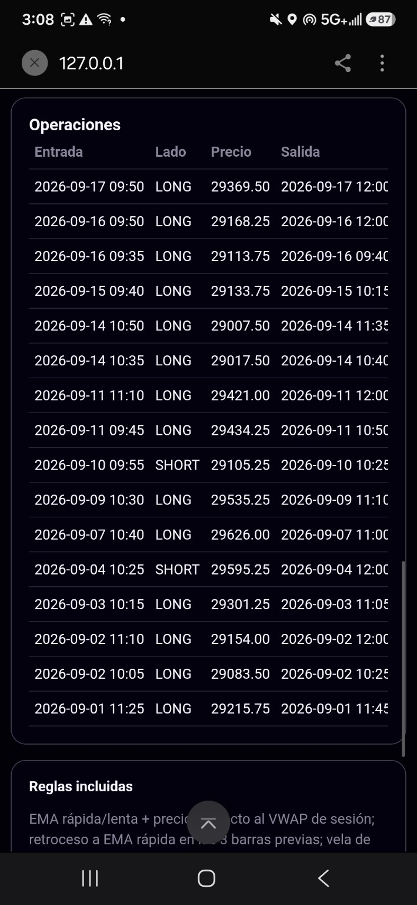

<div align="center">
  
</div>

<h1 align="center">NQ Vector 5M</h1>
<p align="center"><strong>Un laboratorio local para investigar estrategias de MNQ en 5 minutos.</strong></p>

<p align="center">
  
  
  
  
</p>

**NQ Vector 5M** carga datos históricos CSV, aplica supuestos de comisión y deslizamiento y muestra las métricas, la curva de capital y el registro de operaciones. También puede generar un borrador de NinjaScript C# para validarlo en NinjaTrader.

> **Solo investigación local.** No se conecta a brokers ni envía órdenes. Un backtest corto no demuestra rentabilidad futura.

## Vista previa

### Panel y parámetros

<p align="center"></p>

### Resultados y curva de capital

<p align="center"></p>

### Operaciones registradas

<p align="center"></p>

*Las capturas muestran una prueba exploratoria de una muestra breve. No representan una validación estadística ni una promesa de resultados.*

## Funciones

- Lee exportaciones Minute de NinjaTrader, incluso CSV separados por punto y coma, sin encabezados y con timestamp UTC.
- Acepta CSV OHLCV con encabezados comunes.
- Agrupa datos de minuto en velas de cinco minutos.
- Permite configurar EMA rápida/lenta, ATR, objetivo R, horario, operaciones máximas y límite diario.
- Incluye valor por punto de MNQ, comisión ida/vuelta y deslizamiento por lado.
- Presenta PnL neto, win rate, expectativa, factor de ganancia, drawdown, R medio, curva de capital y tabla de operaciones.
- Exporta un borrador NinjaScript C# con los parámetros seleccionados para revisión en NinjaTrader.
- Interfaz adaptable a teléfono y escritorio; backend Python sin dependencias externas.

## Reglas de la estrategia de ejemplo

La estrategia busca retrocesos a favor de la tendencia de EMA y comprueba el precio respecto al VWAP de sesión. Una vela de confirmación activa la entrada en la apertura de la siguiente barra. El stop se coloca más allá de un extremo reciente con margen ATR y el objetivo usa un múltiplo de riesgo. Si el stop y el objetivo se tocan dentro de la misma vela, el simulador cuenta primero el stop.

## Ejecución

### Computadora

Requiere Python 3.9 o posterior. No necesita paquetes adicionales.

```bash
python nq_vector_5m.py
```

Abre **http://127.0.0.1:8765**, selecciona tu CSV y ejecuta el backtest. Mantén la terminal abierta mientras usas el panel; `Ctrl+C` detiene el servidor.

### Android con Termux

```bash
pkg install python
python nq_vector_5m.py
```

Deja Termux abierto y abre **http://127.0.0.1:8765** en Chrome desde el mismo teléfono.

## Datos CSV

Para reproducir reglas intradía de cinco minutos, usa datos de minuto. El CSV de NinjaTrader sin encabezados debe incluir seis columnas: timestamp, open, high, low, close y volume. Revisa las fechas, zona horaria, barras faltantes y cambios de contrato antes de interpretar los resultados. **No subas CSV de mercado con licencia o datos privados al repositorio público.**

## Exportación NinjaScript

El archivo `.cs` exportado es un punto de partida para revisión. Impórtalo y compílalo en NinjaTrader, configura allí las comisiones y el deslizamiento, y compara las operaciones con Strategy Analyzer antes de probar en simulación. El borrador no ha sido certificado para operar en vivo.

## Límites de la prueba

Una muestra corta y pocos trades pueden producir métricas inestables. Antes de sacar conclusiones, prueba más años y distintos regímenes, conserva un periodo fuera de muestra y revisa que los costos y la calidad de datos sean realistas. Los resultados pasados no garantizan resultados futuros.

---

<details>
<summary><strong>English</strong></summary>

NQ Vector 5M is a local Python dashboard for exploring MNQ five-minute strategies with historical CSV data. It models commissions and slippage, reports performance metrics and trades, and exports a NinjaScript C# draft for review in NinjaTrader. It does not connect to a broker or submit orders. Short backtests are exploratory and do not establish future profitability.

</details>

<p align="center"><sub>Built by HugginArts · Research carefully. Validate before paper trading.</sub></p>
